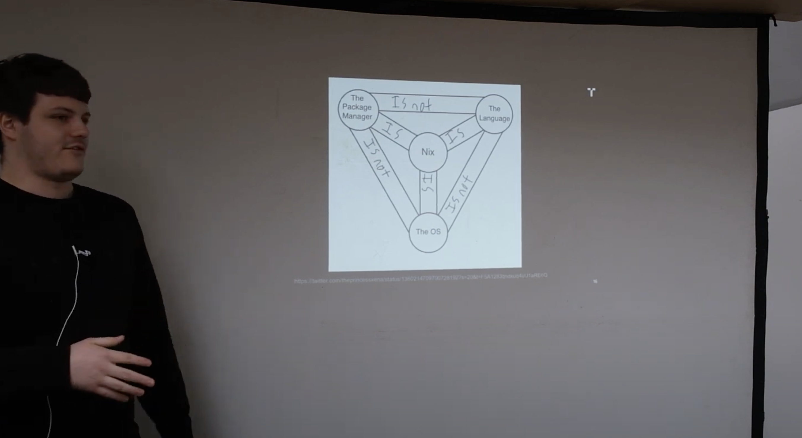

## Nix とは何か？

「Nix」と呼ばれるものは複数ある。パッケージマネージャ、言語、OS。下にあるような図を他のところでも見たことがあるが、「Nix」と呼ばれるものの区別の仕方として参考になる：

(<https://youtu.be/gUjvnZ9ZwMs?si=6st-z_GQFv0EKIwr&t=477>より)

- Nix とはパッケージマネージャである。
- Nix とは言語である。
- Nix とは OS である。
- Nix と呼ばれるパッケージマネージャは言語ではなく、OS でもない。
- Nix と呼ばれる言語は OS ではなく、パッケージマネージャでもない。
- Nix と呼ばれる OS はパッケージマネージャではなく、言語でもない。

だが、OS とパッケージマネージャを利用するために、Nix 言語を活用する。

これらの3つはいずれも同じロゴを使っているから尚更ややこしい。

なので Nix について話している時や、Nix について情報収集しているときにはどの「Nix」について話しているのか注意しないといけない。

## Nix 資料集

- 公式ドキュメント：<https://nix.dev/>
- パッケージマネージャで使えるパッケージを検索するページ：<https://search.nixos.org/packages>
- 公認の資料集：<https://github.com/nix-community/awesome-nix>
- Nix 関連の学術研究：<https://nixos.org/research/>
- Nix Pills：<https://nixos.org/guides/nix-pills/>
