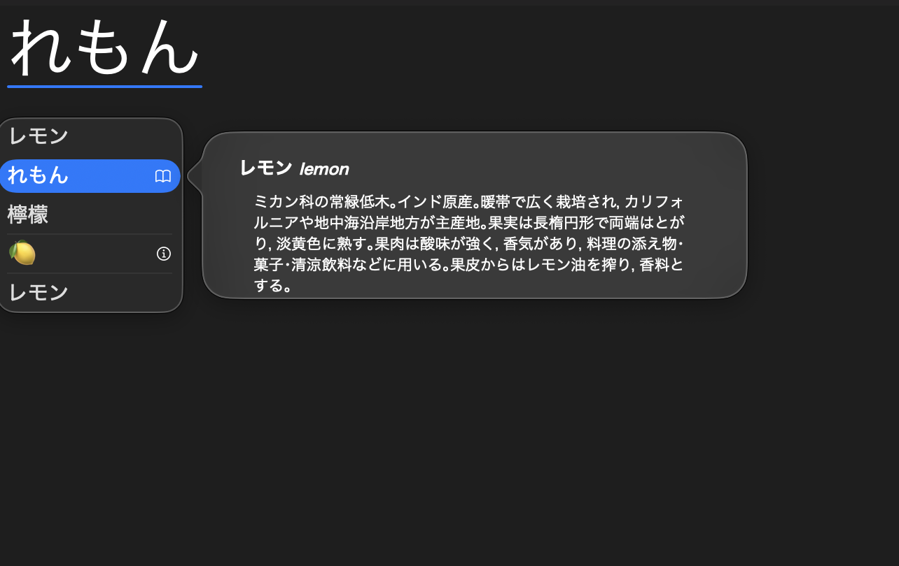

"薔薇" is the Japanese kanji that reads "bara" and it means rose. It's a complex kanji and I don't know how to write it by hand.

I also don't know how to write "檸檬", which both reads and means lemon.

Does it matter I can't handwrite these two words?

Not really. If I ever do need to handwrite the two words above, I can just write them in their katakana form. The meaning gets across to the reader, and their katakana forms are actually even more commonly used than their kanji counterparts. For digital writing, I just type in their hiragana form and go through the suggested conversions to find their kanji representation.

Ever since I last took Japanese in school 5 years ago, I have rarely had to handwrite anything for that matter. So it's the same story for other words too.

All I need to know is just how to read their kanji form. Then, I can write type that out in hiragana, and wait for the list of conversion suggestions to give me the correct kanji. Since I can read the kanji, I can pick it out from the list of suggestions. If I really do need to handwrite a kanji I can't recall, I can type it out and use the kanji on screen as a reference.

The kanji for a word is just the form that is given to it by society. This is similar to programming syntax. Any program *could* just be represented with [only whitespace characters](https://en.wikipedia.org/wiki/Whitespace_%28programming_language%29).

With LLMs getting better and better at coding, maybe we will not need to know how to write code off of the top of our head. Maybe the programming languages of the future won't be designed for humans, but instead [for LLMs](https://github.com/TakatoHonda/sui-lang).

There is a downside to not being able to write kanji off the top of my head though. I am likely susceptive to being tricked. If one of the smaller strokes in the kanji for rose (薔薇) was missing, I probably wouldn't notice that difference.

There are characters with minor differences which I have to be careful with. "荻野" and "萩野" look very similar, but one reads "Ogino" and the other "Hagino", which are two different surnames.

Similarly, I'd likely not notice a minor syntactic error for a programming language which I have not much mastery in. However, for syntactic errors, compilers (or linters or what have you) catch these for us. So maybe minor syntactic issues are not something to be so concerned with going into the future.

But what we do need to know is the semantics of the program we want to write.

If we get an LLM today to write out Quicksort, it's likely to be incorrect or inefficient. Compilers don't catch this mistake for us, so we need to know the idea of how Quicksort works.

Perhaps even further into the future though, LLMs will also take care of the semantics for us just fine. Then, programming could likely be done by an even broader set of people than today.
