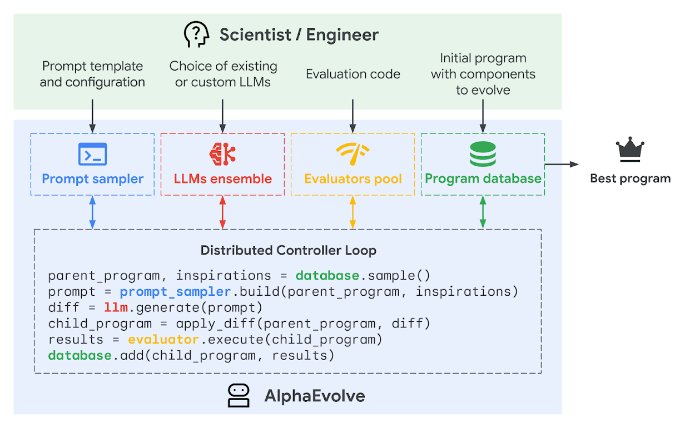

Both LLMs for code generation, and formal verification for verifying correctness of code, have strong upside and downside. Could the two be married to take the best of both worlds?

The field of mathematics has been having interesting developments in this similar combination of technologies. Although LLMs can be used on their own for generating proofs of small-sized and basic mathematics, it's problems with inaccuracy and hallucination are just as prevalent in the field as it is in our day-to-day use. A minor inacurracy in your email might be acceptable, but math demands rigour.

The [Lean](https://lean-lang.org/) programming language has been garnering attention and popularity in mathematics to possibly mitigate this issue. It is a theorem prover tool, that can be used to describe mathematical statements in code, and have the statement verified by the language. Already, it has been used by prominent mathematicians such as Peter Scholze, Kevin Buzzard to formalise the proof of Fermat's last theorem, and Terrance Tao (a mathematician regarded by many as possibly the greatest that is living today).

Most notably, Terrance Tao has been very positive about the possibilities of Lean itself, but also in combination with LLMs. He has given several talks on this topic (including one [here](https://youtu.be/e049IoFBnLA?si=kBovlaPZpXghxfzH)), where he discusses AI could propose proofs, which are then automatically verified via something like Lean. He has even started his own [YouTube channel](https://www.youtube.com/@TerenceTao27) where he has been demonstrating videos of him formalising proofs with significant use of LLM code generation.

Utilising formal verification to check the generated proof allows the mathematician to be certain of the correctness of the proof. This isn't just beneficial to the individual working with the LLM to write the proof. Terrance Tao suggests that widespread adoption and acceptance of formal verification tools in mathematics can greatly improve the peer review process as well.

Peer review broadly deals with two aspects. 1. Is the math correct? 2. Is this math interesting/new? If the math is already verified to be correct, then that reduces the work the peer reviewer needs to do. The peer reviewer can focus on what is really the most important part of the review being done by an expert.

Could LLMs for software development be used in combination with formal verification, like it is being hoped to be used in mathematics? This may allow software engineers to focus on the software's importance/signficance, rather than it's correctness. Obviously the domains in comparison have vast differences, such as the definition of correctness in software development, or mathematical research placing value in novelty and significance to the specific field.

But perhaps there is a role that formal verification can play in improving AI generated code.

In mathematics it's slowly being shown to aid mathematicians and LLMs. Not just Terrance Tao showcasing the power they possess in combination, but also [achieving silver-medal scores at International Mathematical Olympiad problems](https://deepmind.google/discover/blog/ai-solves-imo-problems-at-silver-medal-level/) (although yes, mathematics research and solving competition style questions are two different domains).

In the process of writing this, Google DeepMind has just released information about [AlphaEvolve](https://deepmind.google/discover/blog/alphaevolve-a-gemini-powered-coding-agent-for-designing-advanced-algorithms/) which seems to be doing soemthing similar to what I propose here. Although I'm not able to find how exactly it works, it seems to be doing some form of verification of the work being generated by LLMs for its correctness.

It seems to have already contributed to optimising their compute servers, improve data center scheduling, assisting in hardware design, and discovering lots of new maths along the way. The domain that AlphaEvolve covers is quite limited at this stage, but perhaps it or similar ideas could be extended to work on a wider range of code generation tasks.
