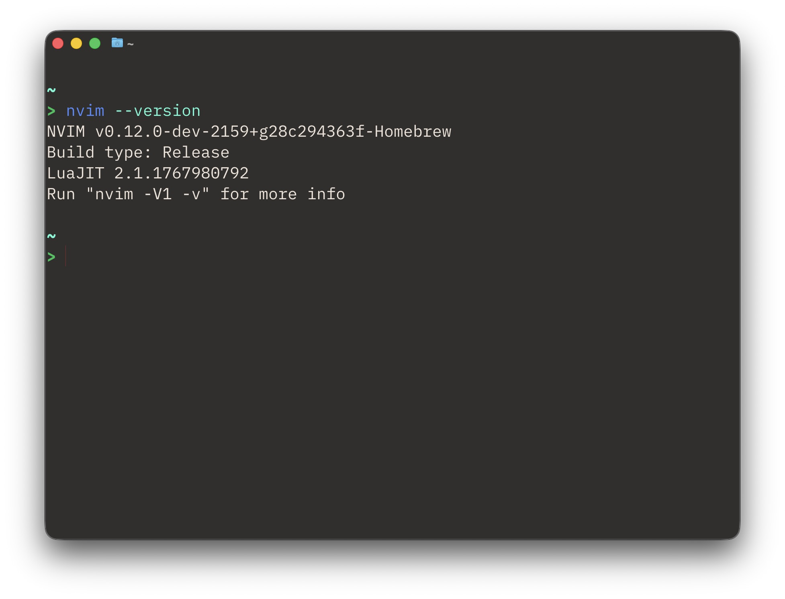

A few months ago I had made my [farewells with Neovim](https://yutatokoi.com/posts/farewell-neovim/).

But now I'm back. The reason? A coworker at the office. They told me that debugging your editor gives you a sense for debugging programs.

So I've updated to the HEAD version, allowing me to use v0.12. 

This has support for a neovim official package manager, which also allows me to install LSPs very easily. Below is an example of an LSP for Go in action. 

I probably won't have much programming opportunities until university starts again next month, and by then hopefully v0.12 will have a stable release. Since AI is mostly prohibited, I want to make my editing experience something I enjoy again. VSCode is nice for what it brings out of the box, but the sluggishness, and the vim motions not feeling quite right has been a bit of a pain.
